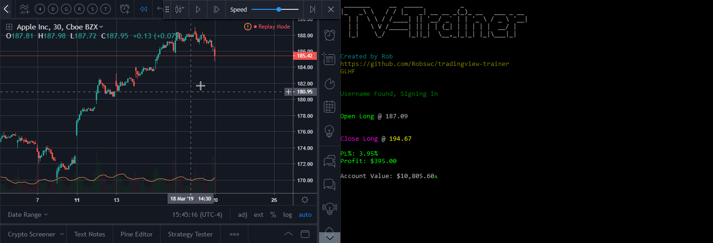

# Tradingview-Trainer


## How to Use
Once installed, run the app.  It will open tradingview in a browser window.  Pressing the **F7 Key** will open a long position at the cursors location.  Pressing the **F8 Key** will open a short position, or if you are currently long, will close the long position and vice versa.  

Once you are finished, simply close the trainer window.  A csv file will be generated, containing your trades.

## Installation
It is recommended to use the python version of this app.  It will be updated more frequently and allows for more user settings.

### Python

If you are familiar with python, you can just clone the repo and run.

If you aren't familiar with python that's ok, its easy to install and run!

Download Python 3.(anything number) here:

https://www.python.org/downloads/

Download this repo (app) with this link:

https://github.com/Robswc/tradingview-trainer/archive/master.zip

Once both are downloaded, unzip the tradingview-trainer.zip file.  Open a terminal in the tradingview-trainer/app directory and run the command:

```
pip install -r requirements.txt
```

Next, run the command:

```
python app.py
```

And that's it!  You can delete the 'dist' folder by the way, as you won't need it for the python version.

### Executable
I know not everyone wants to deal with python.  That's why I have compiled an executable!  You can get the executable here:

You will also need chromedriver, which can be found here:

[what is chromedriver?](http://chromedriver.chromium.org/)

Place both executables within the same folder and then run app.exe.  You will be brought to tradingview's log-in page.  You can either sign-in or hit enter.  It will then re-direct to the charts page.

## Config/Settings
If you are using the python version, you can set a username and password in the config file.  If the app is going to the chart before it is able to sign you in, set the sleep to 4 or higher.
